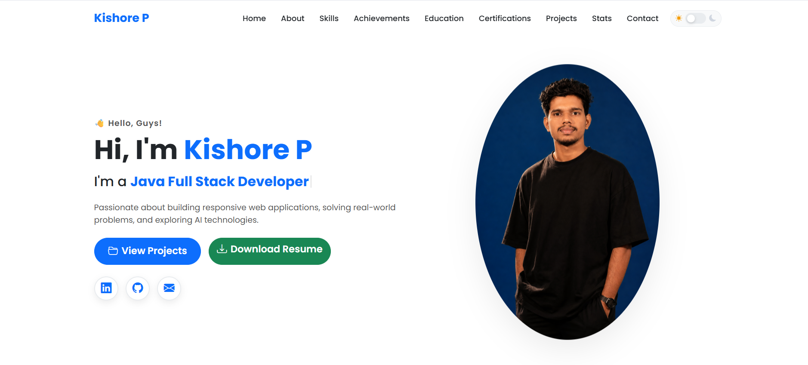
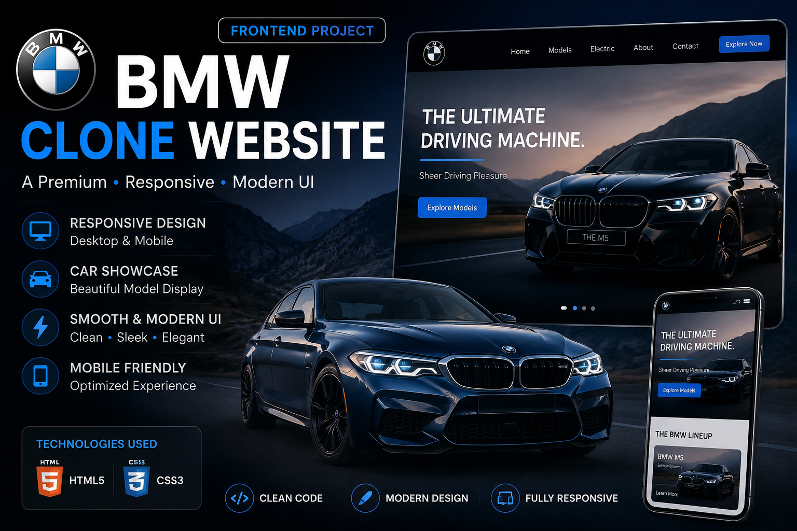
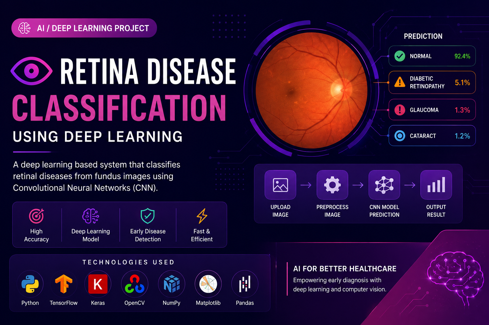

# 💼 Personal Portfolio Website

## 📸 Portfolio Preview



---

## 🌟 Overview

Welcome to my Personal Portfolio Website!

This portfolio was designed and developed to showcase my technical skills, projects, achievements, and professional journey as a developer. It serves as a digital portfolio where recruiters, developers, and visitors can explore my work, learn about my technical expertise, download my resume, and connect with me directly.

The website was built from scratch with a strong focus on responsive design, modern UI principles, user experience, and performance optimization.

---

## 👨‍💻 About Me

Hi, I'm **Kishore P**.

I'm a passionate developer with interests in:

* ☕ Java Development
* 🌐 Front-End Web Development
* 🤖 Artificial Intelligence & Machine Learning
* 🔧 Problem Solving
* 📱 Responsive Web Design

I enjoy building real-world applications that combine clean design, functionality, and user experience while continuously expanding my technical knowledge.

---

## 🚀 Key Features

### Responsive Design

* Fully responsive layout optimized for desktop, tablet, and mobile devices
* Flexible and adaptive user interface
* Mobile-first development approach

### Modern User Interface

* Clean and professional design
* Smooth navigation experience
* Well-structured content organization
* Attractive visual presentation

### Project Showcase

* Dedicated section for featured projects
* Project descriptions and previews
* Easy access to project information

### Resume Integration

* Resume download functionality
* Quick access for recruiters and hiring managers

### Contact Section

* Interactive contact form
* Social media integration
* Easy communication options

### Form Validation

* JavaScript-based client-side validation
* Input verification before submission
* Improved user experience and data accuracy

### Email Integration

* EmailJS integration for contact form functionality
* Direct message delivery without backend implementation

---

## 🛠️ Technologies Used

### Front-End Technologies

* HTML5
* CSS3
* Bootstrap
* JavaScript

### Tools & Services

* EmailJS
* Git
* GitHub

---

## 📁 Project Structure

```text
Portfolio/
├── README.md
├── index.html
├── style.css
images/
  │
  ├── bmw-clone.png
  ├── bmw-project.png
  ├── bootstrap.jpg
  ├── css.jpg
  ├── github.png
  ├── html.jpg
  ├── java.png
  ├── javascript.jpg
  ├── pneumonia-project.png
  ├── portfolio-preview.png
  ├── portfolio-project.png
  ├── profile.png
  ├── retina-classification.png
  ├── retina-project.png
  ├── sql.png
  ├── student-project.png
  ├── tensorflow.png
  └── weather-project.png
```

---

## 📂 Featured Projects

### 🚗 BMW Website Clone



A responsive multi-page clone inspired by the official BMW website, developed using modern front-end development practices and responsive design principles.

#### Highlights

* Pixel-perfect layout implementation
* Responsive design across all devices
* Interactive navigation menu
* Custom image carousel
* Smooth animations and transitions
* Modern UI/UX design

---

### 👁️ Eye Retina Disease Classification



An AI-powered deep learning project developed to classify retinal diseases from fundus images and assist in early disease detection.

#### Highlights

* Convolutional Neural Networks (CNN)
* Medical image classification
* Automated disease detection
* Deep learning implementation
* Early diagnosis assistance
* Healthcare-focused AI solution

---

## 🎨 UI/UX Highlights

* Modern Portfolio Design
* Professional Layout Structure
* Responsive Navigation
* Consistent Typography
* Mobile-Friendly Experience
* Organized Content Sections
* Smooth User Interaction

---

## 📈 Skills Demonstrated

### Programming

* Java
* JavaScript

### Web Development

* HTML5
* CSS3
* Bootstrap
* Responsive Design

### Tools

* Git
* GitHub
* EmailJS

### AI / Machine Learning

* Deep Learning
* Convolutional Neural Networks (CNN)
* Medical Image Classification

---

## 🎯 Project Objectives

The primary objectives of this portfolio are:

* Showcase technical skills and projects
* Demonstrate front-end development capabilities
* Present professional achievements
* Provide easy access to my resume
* Establish a strong online presence
* Enable recruiters to evaluate my work efficiently

---

## 📬 Connect With Me

### GitHub

🔗 [GitHub Profile](https://github.com/Kishoremala1234)

### LinkedIn

🔗 [LinkedIn Profile](https://www.linkedin.com/in/kishore-paraman/)

### Email

📧 [kishoremala2434@gmail.com](mailto:kishoremala2434@gmail.com)

---

## ⭐ Support

If you found this portfolio interesting, feel free to ⭐ star the repository and connect with me.

Thank you for visiting my portfolio repository!
